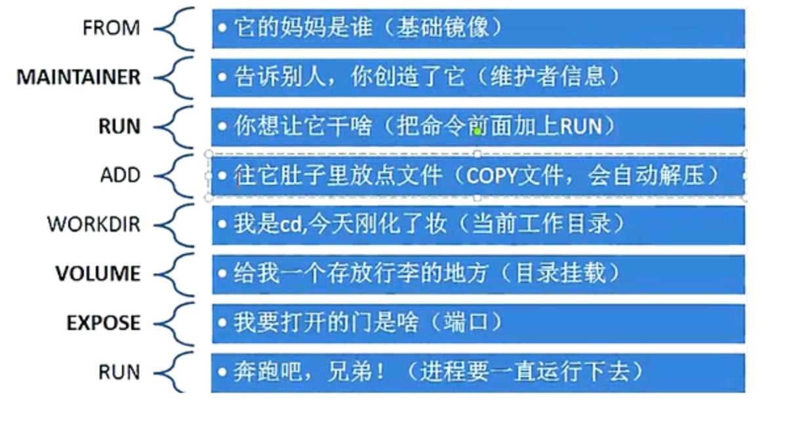

# Dockerfile
---

## 概念
Docker 镜像是一个特殊的文件系统，除了提供容器运行时所需的程序、库、资源、配置等文件外，还包含了一些为运行时准备的一些配置参数（如匿名卷、环境变量、用户等）。镜像不包含任何动态数据，其内容在构建之后也不会被改变。

镜像的定制实际上就是定制每一层所添加的配置、文件。如果我们可以把每一层修改、安装、构建、操作的命令都写入一个脚本，用这个脚本来构建、定制镜像，那么之前提及的无法重复的问题、镜像构建透明性的问题、体积的问题就都会解决。这个脚本就是 Dockerfile。

使用Dockerfile去构建镜像好比堆积木、使用pom去构建maven项目一样，有异曲同工之妙

**官方文档**：https://docs.docker.com/v17.09/engine/reference/builder/

---
## 组成
Dockerfile 一般分为四部分：基础镜像信息、维护者信息、镜像操作指令和容器启动时执行指令

部分|命令
- | :-
基础镜像信息 | FROM
维护者信息 | MAINTAINER
镜像操作指令 | RUN、COPY、ADD、EXPOSE、WORKDIR、ONBUILD、USER、VOLUME、ENV
容器启动时执行指令 | CMD、ENTRYPOINT

---
## 命令详解
**重要**：Docker以从上到下的顺序运行Dockerfile的指令。为了指定基本映像，第一条指令必须是FROM。一个声明以＃字符开头则被视为注释。

#### FROM
指定哪种镜像作为新镜像的基础镜像
```
FROM <image>
FROM <image>:<tag>

如：
FROM mysql:5.6
```
注：tag是可选的，如果不写，会使用latest版本的基础镜像

#### MAINTAINER
指定镜像的作者和其电子邮件
```
MAINTAINER name email

如：
MAINTAINER boyan zhou.lei@dtyunxi.com
```

#### RUN
在新镜像内部执行的命令，比如安装一些软件、配置一些基础环境，可使用`\`来换行
```
shell执行
RUN <command>

exec执行
RUN ["executable", "param1", "param2"]

如：
RUN echo 'hello world'
RUN ["apt-get","install","-y","nginx"]　
```
注： 
1. `executable`是命令，后面的`param`是参数
2. RUN指令创建的中间镜像会被缓存，并会在下次构建中使用。如果不想使用这些缓存镜像，可以在构建时指定--no-cache参数，如：docker build --no-cache

#### COPY
将主机的文件复制到镜像内，如果目的位置不存在，Docker会自动创建所有需要的目录结构，但是它只是单纯的复制，并不会去做文件提取和解压工作
```
COPY <src> <dst>

如
COPY application.yml /etc/springboot/hello-service/src/resources
```
注意：需要复制的目录一定要放在Dockerfile文件的同级目录下，且目的地址为容器内绝对路径

#### ADD
将主机的文件复制到镜像中，与COPY类似，但是ADD会对压缩文件（tar, gzip, bzip2, etc）做提取和解压操作。
```
ADD <src> <dest>

如：
ADD test /absoluteDir/
```

#### EXPOSE
暴露镜像的端口供主机做映射，启动镜像时，使用-P参数来讲镜像端口与宿主机的随机端口做映射。可以指定多个。
```
EXPOSE <port> [<port>...]

如：
EXPOSE 80
EXPOSE 8080
```
注：EXPOSE并不会让容器的端口访问到主机。

#### WORKDIR
指定镜像的工作目录，之后的命令都是基于此工作目录，如果不存在，则会创建目录。类似于cd命令。
```
WORKDIR /path/to/workdir

如：
WORKDIR /a  (这时工作目录为/a)
```
注意：两个WORKDIR命令后，目录是逐步递增。

#### ONBUILD
当一个包含ONBUILD命令的镜像被用作其他镜像的基础镜像时，该命令就会执行。
```
ONBUILD [INSTRUCTION]

如：
ONBUILD RUN /usr/local/bin/python-build --dir /app/src
```

#### USER
指定运行容器时的用户名或 UID，后续的 RUN 也会使用指定用户。使用USER指定用户时，可以使用用户名、UID或GID，或是两者的组合。
```
USER user
USER user:group
USER uid
USER uid:gid
USER user:gid
USER uid:group

如：
USER www
```

#### VOLUME
用来向基于镜像创建的容器添加卷，指定持久化目。
```
VOLUME ["/path/to/dir"]

如：
VOLUME ["/data"]
VOLUME ["/var/www", "/var/log/apache2", "/etc/apache2"
```
注意：一个卷可以存在于一个或多个容器的指定目录，该目录可以绕过联合文件系统

#### ENV
用于设置环境变量
```
ENV <key> <value>
ENV <key>=<value> ... #可以设置多个变量

如：
ENV myName John Doe
ENV myCat=fluffy
```

#### CMD
构建容器后调用，也就是在容器启动时才进行调用
```
CMD ["executable","param1","param2"] (执行可执行文件，优先)
CMD ["param1","param2"] (设置了ENTRYPOINT，则直接调用ENTRYPOINT添加参数)
CMD command param1 param2 (执行shell内部命令)

如：
CMD echo "hello world"
CMD ["/usr/bin/wc","--help"]
```
注意：
1. CMD不同于RUN，CMD用于指定在容器启动时所要执行的命令，而RUN用于指定镜像构建时所要执行的命令
2. *当有多个CMD的时候，只有最后一个生效*

#### ENTRYPOINT
配置容器，使其可执行化。作用和用法和CMD一模一样。
```
ENTRYPOINT ["executable", "param1", "param2"] (可执行文件, 优先)
ENTRYPOINT command param1 param2 (shell内部命令)
```

**注意：重要！！！**
CMD和ENTRYPOINT同样作为容器启动时执行的命令，有一些区别。
 - CMD的命令会被 docker run 的命令覆盖而ENTRYPOINT不会
 - CMD和ENTRYPOINT都存在时，CMD的指令变成了ENTRYPOINT的参数，并且此CMD提供的参数会被 docker run 后面的命令覆盖

---
 ## 使用
 使用`docker build`命令进行镜像构建
 ```
docker build [OPTIONS] <PATH>
 ```

#### 常用参数
-f :指定要使用的Dockerfile路径
--rm :设置镜像过程中删除中间容器
-t: 镜像的名字及标签，通常 name:tag 或者 name 格式

更多参数请执行`docker build --help` 查看，包括一些cpu、内存设置等

## 形象描述 


---
## 参考文档
https://www.jianshu.com/p/10ed530766af

https://www.cnblogs.com/lienhua34/p/5170335.html

https://www.cnblogs.com/ityouknow/p/8588725.html

https://www.cnblogs.com/panwenbin-logs/p/8007348.html

https://www.cnblogs.com/jsonhc/p/7767669.html

