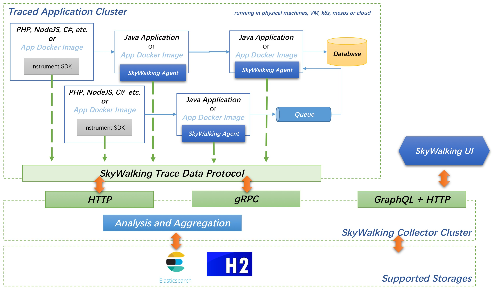

# SkyWalking
---
## 简介
SkyWalking 创建于2015年，提供分布式追踪功能。从5.x开始，项目进化为一个完成功能的APM(Application Performance Monitoring)系统。
用于追踪、监控和诊断分布式系统，特别是使用微服务架构，云原生或容积技术。

提供以下主要功能：
分布式追踪和上下文传输
应用、实例、服务性能指标分析
根源分析
应用拓扑分析
应用和服务依赖分析
慢服务检测
性能优化

官网：http://skywalking.apache.org/

## 架构


主要分三部分：

1. skywalking-collector：链路数据归集器，数据可以落地ElasticSearch或H2
2. skywalking-web：web可视化平台，用来展示落地的数据
3. skywalking-agent：探针，用来收集和发送数据到归集器

## 部署
skyswalking 可以使用H2或者Elasticsearch作为后端存储，以下部署均选择elasticsearch

---
#### 本地部署方案
**部署Elasticsearch，选择5.6版本**
下载安装包
```
wget https://artifacts.elastic.co/downloads/elasticsearch/elasticsearch-5.6.14.tar.gz
tar zxvf elasticsearch-5.6.14.tar.gz
cd elasticsearch-5.6.14/
```
修改配置文件`config/elasticsearch.yml`，新增配置
```
cluster.name: CollectorDBCluster

# ES监听的ip地址
network.host: 0.0.0.0
thread_pool.bulk.queue_size: 1000
```
保存后，执行脚本启动elasticsearch
```
nohup bin/elasticsearch &
```
**部署skywalking**
下载安装包
```
wget http://mirror.bit.edu.cn/apache/incubator/skywalking/5.0.0-GA/apache-skywalking-apm-incubating-5.0.0-GA.tar.gz
tar xvfz apache-skywalking-apm-incubating-5.0.0-GA.tar.gz
cd apache-skywalking-apm-incubating
```
检查端口占用情况（8080, 10800, 11800, 12800），启动skywalking服务
```
sh bin/startup.sh
```
*注意：* 配置文件`config/application.yml`中`clusterName`的值需要与前文elasticsearch中的集群名称保持一致

访问`localhost:8080`或者`IP:8080`即可访问页面

---
#### 容器化部署方案
skywalking官方的docker方案在本文记录时还没有发布，此处使用**JaredTan95**大佬的image来部署
参考地址：https://github.com/JaredTan95/skywalking-docker
images:
https://hub.docker.com/r/wutang/elasticsearch-shanghai-zone
https://hub.docker.com/r/wutang/skywalking-docker

**启动elasticsearch容器**
```
docker run -p 9200:9200 -p 9300:9300 -e cluster.name=elasticsearch -e xpack.security.enabled=false -d wutang/elasticsearch-shanghai-zone:5.6.10
```
**启动skywalking容器**
```
docker run -d  --net=host \
-m 2048m --memory-swap 2400m \
-e DAE_SEGMENT="^127\.0\.\d{1,3}.\d{1,3}$" \
-e JAVA_OPTS="-Xms1024m -Xmx2048m" \
-e ES_CLUSTER_NAME=elasticsearch \
-e ES_ADDRESSES=172.17.0.3:9300 \
wutang/skywalking-docker
```
 - 上面的DAE_SEGMENT需要根据实际情况进行修改。比如你的宿主机ip是10.1.1.2，那么此处需要更改为^10\.1\.\d{1,3}.\d{1,3}$
 - UI_ADMIN_PASSWORD:UI界面中管理员‘admin’的登录密码
 - ES_CLUSTER_NAME,ES_ADDRESSES:elasticsearch 地址和集群名称。注意：此处Elasticsearch地址中的端口务必是Elasticsearch TCP端口（9300）
 - 日志挂载 -v /your/log/path:/apache-skywalking-apm-incubating/logs

浏览器访问 localhost:8080 或 ip:8080 即可访问skywalking web界面

---
## java程序使用skywalking探针
方法：
1. 拷贝apache-skywalking-apm-incubating目录下的agent目录到应用程序位置，探针包含整个目录，请不要改变目录结构
2. java程序启动时，增加JVM启动参数，`-javaagent:/path/to/agent/skywalking-agent.jar`。参数值为skywalking-agent.jar的绝对路径

这样java应用程序在启动后，就可以在skywalking里面看到相关的数据信息。
